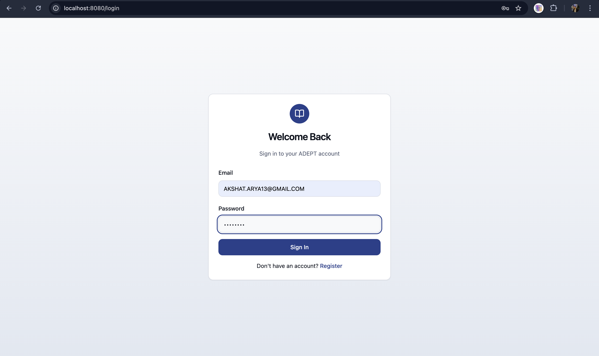
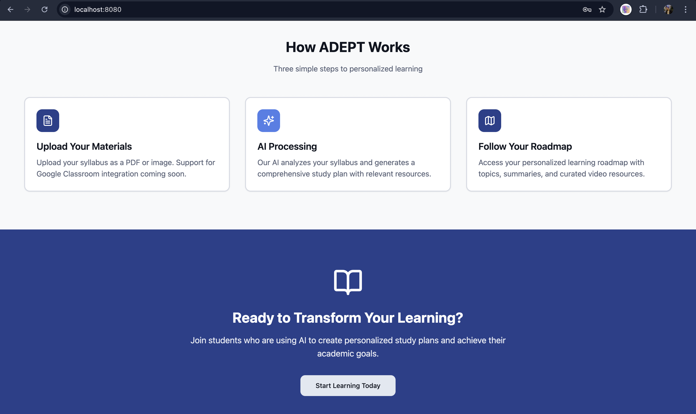
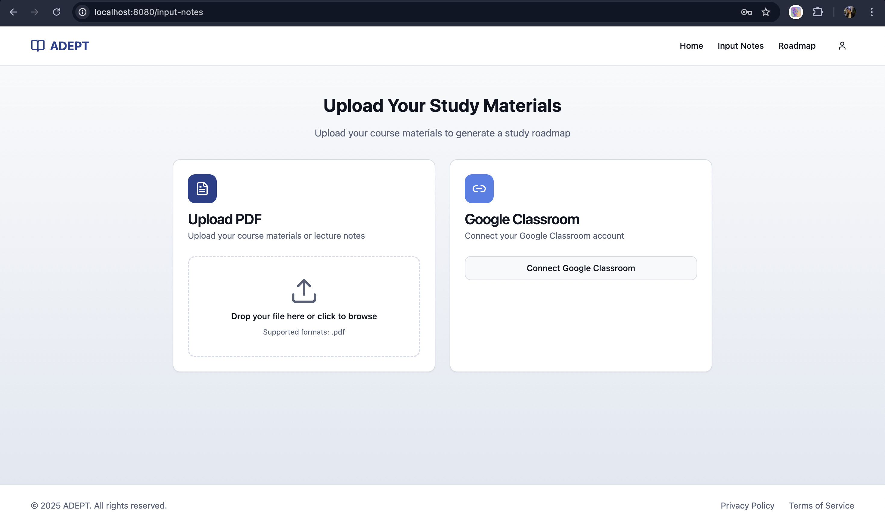
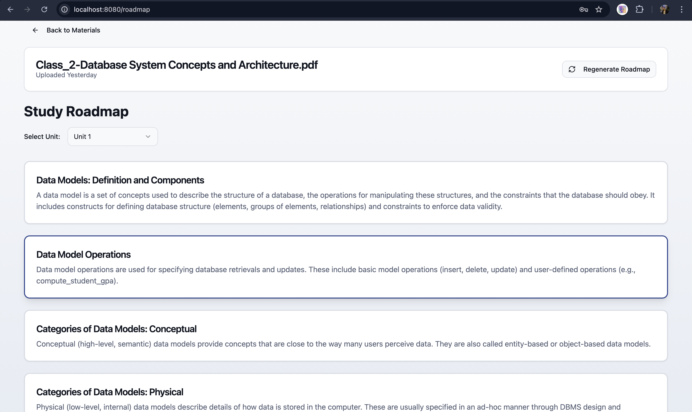

# ADEPT - AI Study Companion

ADEPT is a comprehensive AI-powered study assistant that transforms your syllabus and study materials into personalized learning roadmaps. It leverages the power of Large Language Models (Gemini) to generate structured study plans, explain complex topics, and curate relevant YouTube resources.

## 🚀 Quick Start (Run Locally)

After cloning the repository, open **3 separate terminals** and run the following commands:

**Terminal 1: Backend (Node.js)**
```bash
cd backend && npm install && npm run dev
```

**Terminal 2: AI Engine (Flask)**
```bash
# Ensure you have Python installed. You may need to create a venv first.
# python3 -m venv .venv_new && source .venv_new/bin/activate && pip install -r flask/requirements.txt
python3 flask/app.py
```

**Terminal 3: Frontend (React)**
```bash
cd frontend && npm install && npm run dev
```

---

## 🛠️ Tech Stack

*   **Frontend:** React, TypeScript, Vite, Tailwind CSS
*   **Backend:** Node.js, Express, MongoDB (Mongoose)
*   **AI Engine:** Python, Flask, Google Gemini API, LangChain
*   **Authentication:** JWT (JSON Web Tokens)

---

## 📸 Application Screenshots

### 1. Register 


### 2. Login


### 3. Dashboard


### 4. Upload Interface


### 5. Roadmap Generation


### 6. Topic Explanation 


### 7. Resource Curation

