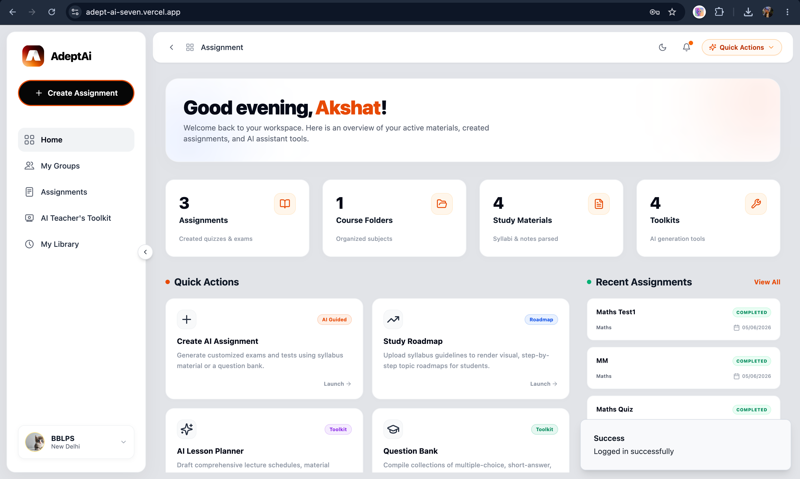
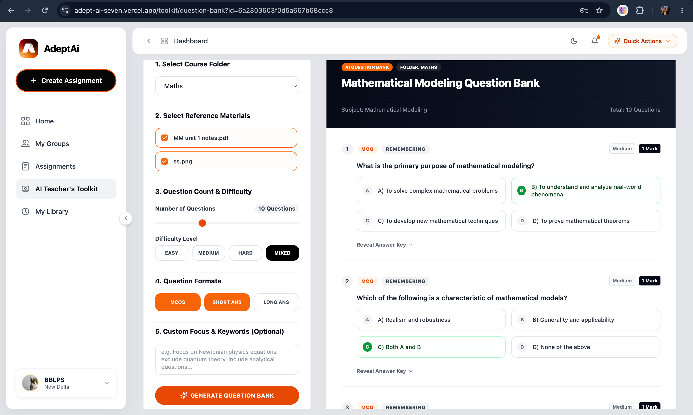
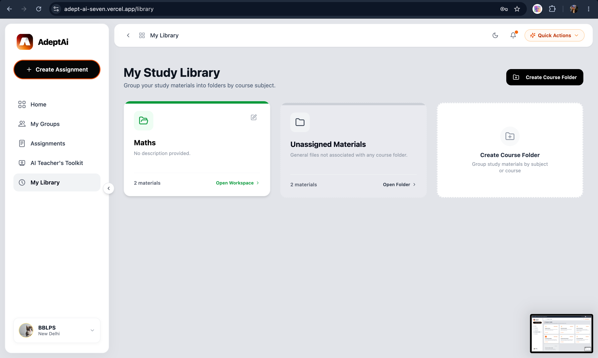
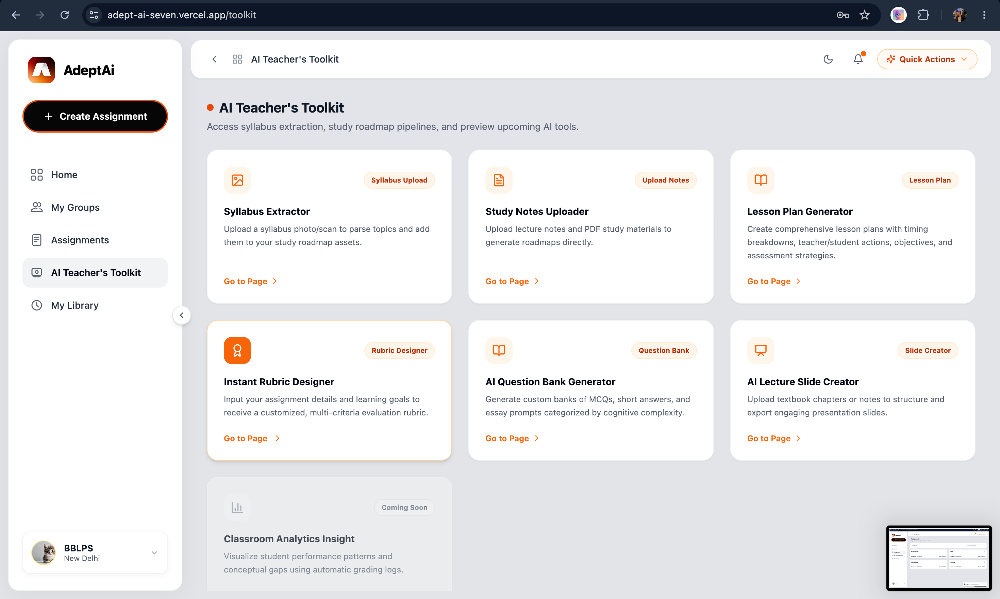

# AdeptAI – AI Assessment Creator & Study Companion

AdeptAI is a production-grade educational platform that combines student roadmap generation with a powerful AI Assessment Creator for teachers. It features background job queuing via Redis/BullMQ, real-time WebSocket notifications via Socket.io, structured text generation via Groq, file extraction (PDF/text), and exam-style PDF generation using PDFKit.

---

## 🌐 Live Deployment
- **Frontend App:** [https://adept-ai-seven.vercel.app](https://adept-ai-seven.vercel.app)

---

## 🎥 Demo Video
🎥 [Watch the AdeptAI Demo Video Walkthrough on YouTube](https://youtu.be/2FcKouCd3xg)

## 📸 Screenshots

### **1. Teacher's Workspace Dashboard**


### **2. AI Exam Creator & Question Bank**


### **3. Optimized Library & File Manager**


### **4. Teacher's Toolkit**


---

## 🛠️ Architecture Overview & Approach

### **Approach**
Our goal was to build a highly responsive and scalable application that doesn't block the user's browser while AI processes run in the background. To accomplish this:
1. **Asynchronous Generation:** When a user requests an assessment, the Node.js backend instantly offloads the heavy LLM prompting to a **BullMQ worker** powered by **Redis**. 
2. **Real-time Feedback:** The worker processes the request and streams status updates back to the React frontend in real-time using **Socket.io** (WebSockets).
3. **Structured AI Output:** Instead of rendering raw LLM text, we enforce strict JSON schema adherence through our LangChain/Groq pipeline. The frontend then dynamically renders this structured JSON into a pixel-perfect, exam-style UI.
4. **Microservice AI Engine:** Heavy PDF extraction (PyMuPDF) and LangChain operations are isolated in a dedicated Python/FastAPI microservice to keep the primary Node API highly available.
5. **Cloud-Native Embeddings & Resource Optimization:** Migrated from heavy local PyTorch-based embeddings (`sentence-transformers`) to Google's cloud-based Gemini embedding API (`gemini-embedding-2` configured to `768` dimensions). This pruned PyTorch and CUDA dependencies completely, resolving Render OOM (Out of Memory) startup errors and shrinking the service memory footprint to under 100MB.
6. **Active Production Keep-Alive**: Configured background self-pinging loops running every 5 minutes in both backend services (including `PING` commands to Redis) to keep services warm and prevent cold starts / spin-downs on free hosting tiers (Render/Vercel).
7. **Resilient Production Startup**: Updated the database and queue initialization so that temporary Redis offline/sleep states do not block backend boot-up or permanently disable background workers. Connection retries continue in the background.
8. **Robust Multi-modal Retries**: Implemented exponential backoff retries for image text extraction calls to Gemini, making the upload and chunking pipeline resilient to transient 503 (Service Unavailable) or 429 (Rate Limit) errors.
9. **Rubric Marks Math Guard**: Integrated an automatic scaling and rounding mechanism for AI-generated rubrics, ensuring intermediate performance scores mathematically align with the criterion's total marks.

### **Tech Stack**
- **Frontend**: React (Vite) + TypeScript + Tailwind CSS + Zustand + Socket.io-client
- **Backend (Node.js)**: Express, Mongoose, Redis (ioredis), BullMQ, Socket.io, PDFKit
- **AI Engine (Python/FastAPI)**: FastAPI, Google Gemini API, LangChain (running on `gemini-embedding-2`)
- **Primary AI Provider**: Groq SDK (`llama-3.3-70b-versatile` & fallback `llama-3.1-8b-instant`) and Google Generative AI (Gemini)


---

## 🚀 Quick Start (Local Setup)

To run the full stack locally, make sure you have **Node.js (v18+)**, **Python 3.10+**, and a running **Redis** instance.

### 1. Redis Service
Ensure Redis is running on `localhost:6379` (or update `REDIS_URL` in `.env`):
```bash
redis-server
```

### 2. Backend (Node.js)
```bash
cd backend
npm install
npm run build
npm run dev
```

### 3. AI Engine (FastAPI)
Create a virtual environment, install requirements, and run the FastAPI server:
```bash
python3 -m venv .venv_new
source .venv_new/bin/activate
pip install -r requirements.txt
uvicorn main:app --host 0.0.0.0 --port 5001 --app-dir fastapi
```

### 4. Frontend (React)
```bash
cd frontend
npm install
npm run dev
```

---

## ⚙️ Environment Variables (Node.js Backend)

Create a `.env` file inside the `backend` folder:
```env
# Server Config
NODE_ENV=development
PORT=4004

# Origins
APP_ORIGIN=http://localhost:5173
FRONTEND_URL=http://localhost:5173
FASTAPI_URL=http://localhost:5001

# Database
MONGO_URI=mongodb+srv://<username>:<password>@cluster.mongodb.net/adeptai

# Security / JWT
JWT_SECRET=your_jwt_access_secret_key
JWT_REFRESH_SECRET=your_jwt_refresh_secret_key

# Paths
RAW_DATA_PATH=./src/constants/rawData
PROCESSED_DATA_PATH=./src/constants/processedData

# AdeptAI Generation Configuration
GROQ_API_KEY=your_groq_api_key
REDIS_URL=redis://localhost:6379
WORKER_CONCURRENCY=3
MAX_SOURCE_CONTENT_CHARS=3000
```
