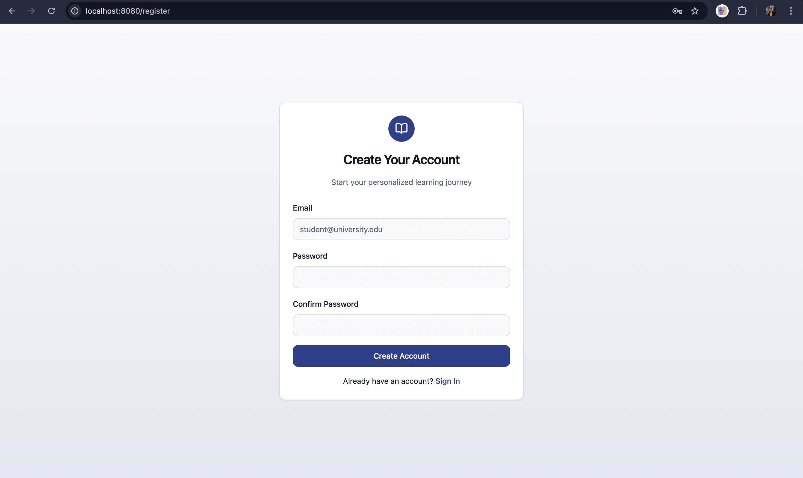
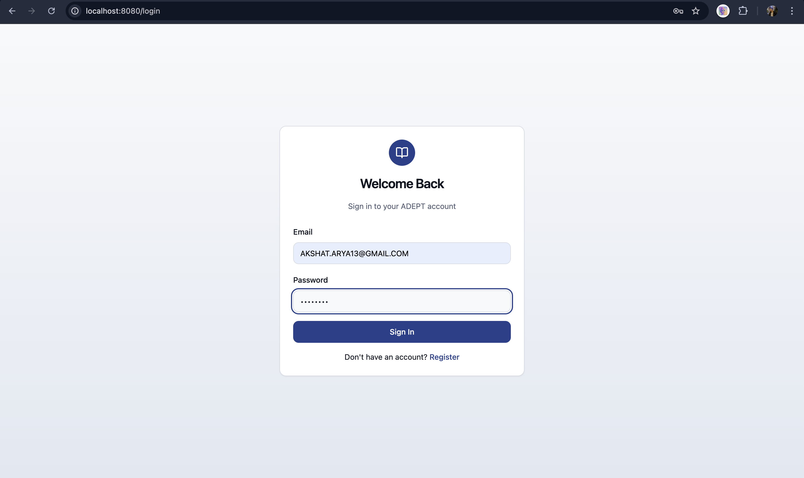
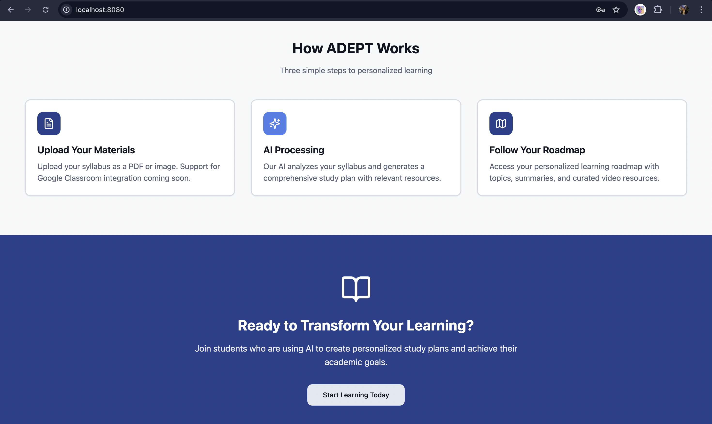
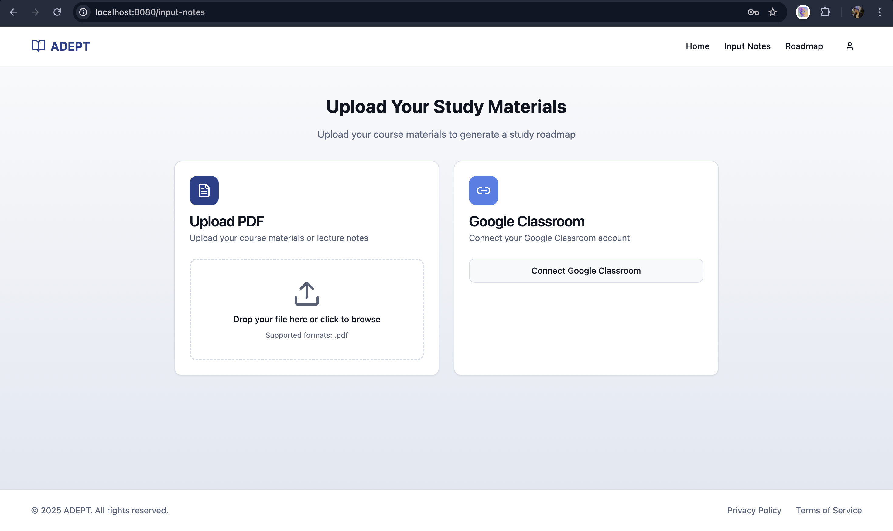
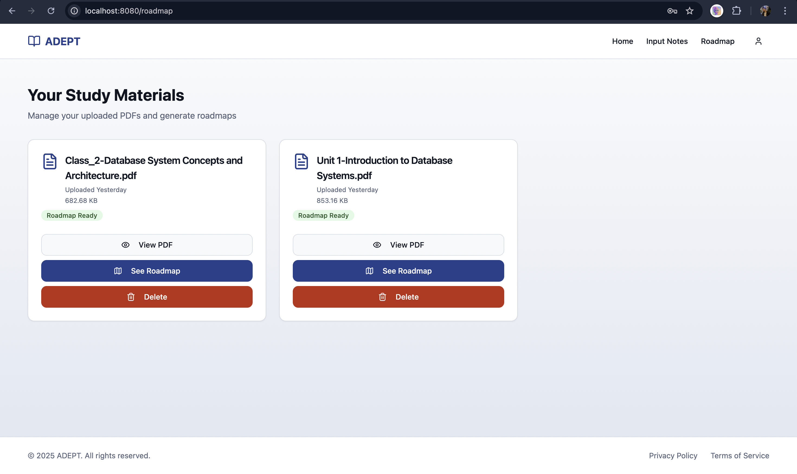
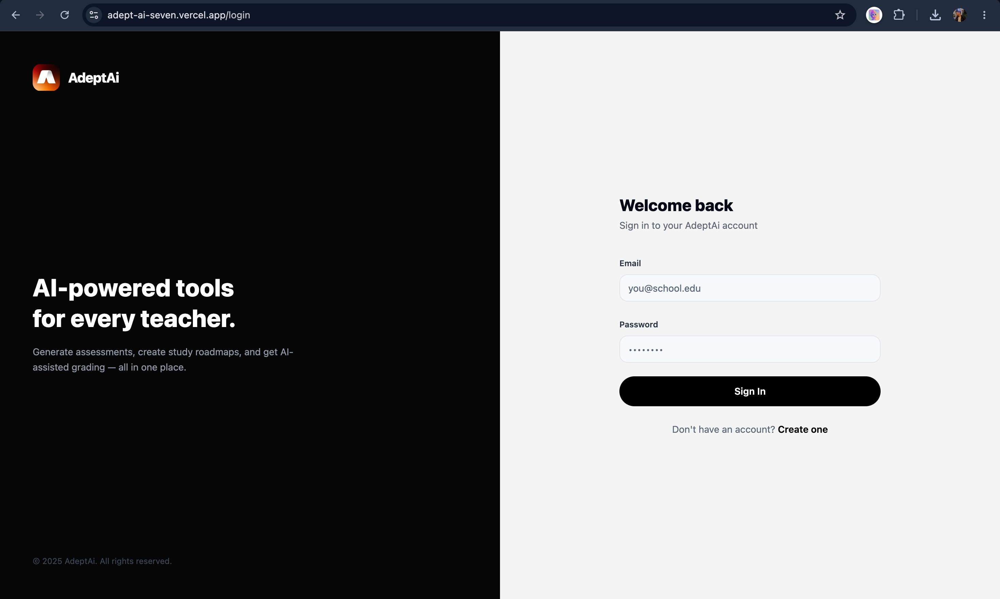
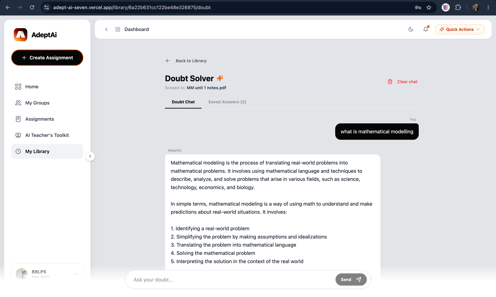
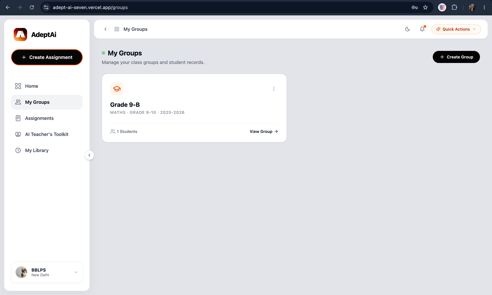
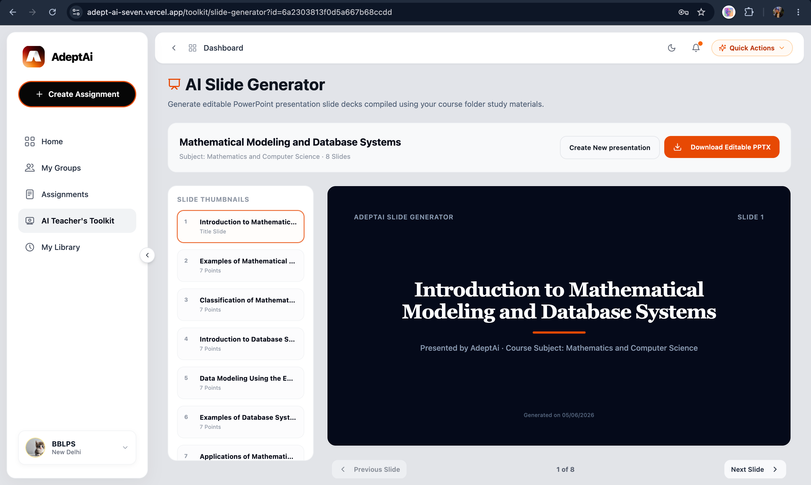

# The Story of AdeptAI: The Resurrected Assistant

In my college, we have a lot of exams. Teachers get constantly overwhelmed with creating exam papers, checking student work, and tracking individual progress. A teacher once told me how much time they waste just doing manual paperwork instead of teaching. That was the spark: *what if an AI could handle all the tedious exam generation, grading rubrics, and personalized study guides?*

That was the birth of **AdeptAI**. 

It first started as a hackathon project, but like many student ideas, it got abandoned midway due to our own exams and was forgotten with time. But with the GitHub-a-thon, I finally got a chance to bring it back to life.

---

## 📅 The Starting Point (Before)

Initially, AdeptAI was a basic student study companion designed to help convert syllabus images or notes PDFs into simple roadmap milestones. 

Here is what the interface looked like before the resurrection:

### 1. Simple Login & Dashboard
The login was standard, and the dashboard was a basic, static layout displaying course files.

*Figure 1: The old, basic authentication screen.*

*Figure 2: The old student dashboard showing loaded courses.*

### 2. Syllabus Upload & Roadmaps
Students could upload a syllabus file to create simple learning roadmaps. However, processing was slow, synchronous, and frequently timed out on large files.

*Figure 3: The initial syllabus upload screen.*

*Figure 4: A basic, linearly generated study roadmap.*

### 3. Basic Doubt Solvers
Clicking a topic card opened a simple panel providing standard LLM definitions and raw YouTube tutorials.

*Figure 5: The original topic explanation panel.*

---

## 🚀 The Upgrade Journey (After)

With the GitHub Finish-Up-a-thon, we didn't just fix the bugs—we completely rebuilt AdeptAI into a unified, high-performance learning suite for both teachers and students.

Here is the upgraded interface:

### 1. Modern Workspace & VedaAI Branding
We refreshed the design language, introduced a unified layout with custom theme panels, and synchronized user avatars in real-time.

*Figure 6: The updated authentication page with modern panels.*

*Figure 7: The new dashboard workspace featuring active course metrics.*

### 2. High-Performance Library & Async Pipelines
We optimized database queries to exclude heavy JSON payloads (`-roadmapData`) so library lists load in milliseconds. We also added Redis and BullMQ queues to handle roadmaps in the background, showing real-time progress bars via Socket.io.

*Figure 8: Optimized Library view with instant document load speeds.*

### 3. Intelligent Doubt Solving
We replaced discontinued Gemini endpoints with a resilient, self-healing model sequence (trying `gemini-3.5-flash` first, falling back to `gemini-2.5-flash`), securing seamless image-text extractions even under high load.

*Figure 9: The upgraded interactive Doubt Solver companion.*

### 4. The Teacher's Toolkit
We introduced a teacher suite designed to make exam creation and grading easy:
* **Rubrics Generator:** Splits total marks mathematically into structured grades automatically.
* **AI Question Bank & Slides:** Generates questions by difficulty and compiles study slides.
* **Groups Management:** Arranges students into active project teams.

*Figure 10: The new Teacher's Toolkit dashboard.*

*Figure 11: The AI Exam Creator with custom difficulty splits.*

*Figure 12: Group management workspace for classroom collaboration.*

*Figure 13: Slide deck generator workspace.*

---

## 🛠️ The Tech Stack (Under the Hood)
* **Frontend:** React (Vite) + TypeScript + Tailwind CSS + Zustand + Socket.io-client
* **Backend:** Node.js (Express) + MongoDB (Mongoose) + Redis (ioredis) + BullMQ + Socket.io + PDFKit
* **AI Engine:** Python (FastAPI) + Google Gemini API (`gemini-3.5-flash` & `gemini-embedding-2`) + LangChain + Groq SDK (`llama-3.3-70b-versatile`)
* **File Storage:** Supabase Cloud Storage
* **Deployments:**
  * **Vercel Client:** https://adept-ai-seven.vercel.app
  * **Render API Backend:** https://adept-ai.onrender.com
  * **YouTube Demo Walkthrough:** https://youtu.be/2FcKouCd3xg
